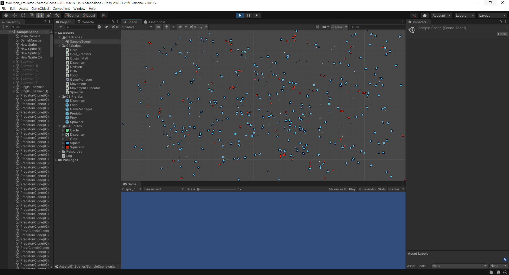
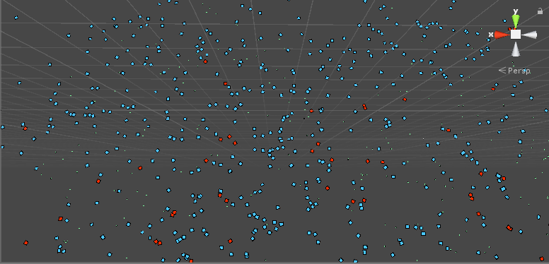
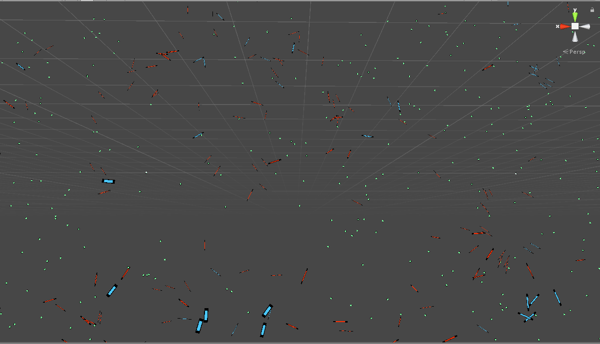

# Evolution-sim

This project involves a simulator for a  simple ecosystem with mutations, and some testing records. We can that with some simple rules, the simulated system resembles some features of the real natural ecosystem. (and  just watching the creatures moving around is fun too)

## Ecosystem rules

The evolution simulator runs a simple ecosystem composed of three levels of food chain.  The stationary resource (green), prey (blue), and predator (red). The prey and predator are  those that perform life activities, while the stationary resource performs the role of constant enery input to the system (for example, sunlight). We will call both prey and the predator "creatures".
Stationary resources are, stationary. And are constantly generated around the system. There is a limit to the number of stationary resources existing in the system. (It cannot be infinitely stacked up)
Preys perform the role of middle-class in the foodchain pyramid. They can move around, consume the stationary resources, reproduce, and starve to death. Likewise, the predators do pretty much the same, except that they consume the preys instead of the stationary resources.

## Creature behavior

1. Energy: Each creature has its own energy. The enery of a creature decreases constantly, and the decrease rate is proportional to the square root of the area of the creature. When energy is reduced to 0, the creature dies. Both the prey and the predator gains 1 energy each time it consumes its food.
2. Scanning: A creature scans  the nearby environment periodically. If its food is within the scan area, the creature steers itself to the nearest food. The prey priorities survival, so if a predator is within the scan area, it steers to the opposite direction of the predator.
3. Reproduction: When a creature has enough energy to spare, it performs dichotomy to reproduce. 

## Creature traits

1. Movement speed: The moving speed of a creature.
2. Scanning period: The time invertal between performing a new scan.
3. Rotation speed: The steering speed of a creature.
4. Width, Height: The width and height of a creature. Their product is the area of the creature, which determines the enegy efficiency.

## Mutation rules

When a creature reproduces, mutation happens with probability of 0.1. When mutation happens, mutation function is performed for all five traits (movement speed, scanning period, rotation speed, width, height). The mutation function takes the range of a trait value and a mutation strength value, and outputs a new trait value. The new trait value follows a normal distribution centered at the original trait value, and its variance is determined by the mutaion strength value.

