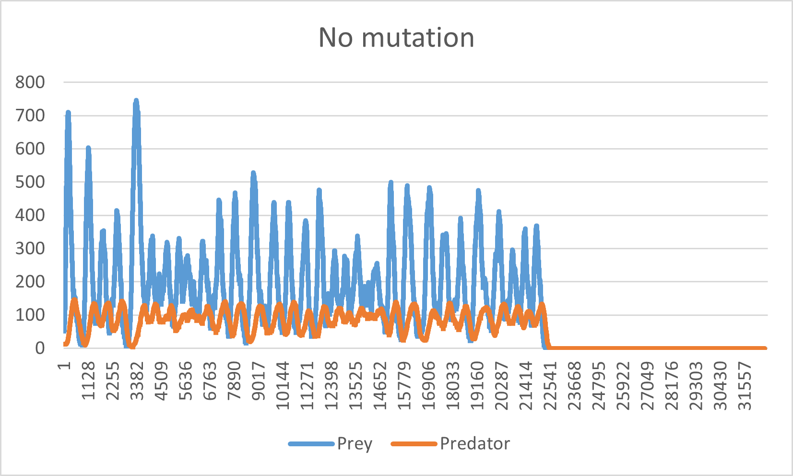

# Evolution-sim

This project involves a simulator for a  simple 2-D ecosystem with mutations, and some testing records. We can see that with some simple rules, the simulated system resembles some features of the real natural ecosystem. (and  just watching the creatures moving around is fun too)

## Ecosystem rules

The evolution simulator runs a simple ecosystem composed of three levels of food chain; **stationary resource (green), prey (blue), and predator (red)**. The prey and predator are  those that perform life activities, while the stationary resource performs the role of constant energy input to the system (for example, sunlight). We will call both prey and the predator "creatures".  
Stationary resources are, stationary. And are constantly generated around the system. There is a limit to the number of stationary resources existing in the system. (It cannot be infinitely stacked up)  
Preys perform the role of middle-class in the food chain pyramid. They can move around, consume the stationary resources, reproduce, and starve to death. Likewise, the predators do pretty much the same, except that they consume the preys instead of the stationary resources.

## Creature behavior rules

**1. Energy**: Each creature has its own energy. The energy of a creature decreases constantly, and the decrease rate is proportional to the square root of the area of the creature. When energy is reduced to 0, the creature dies. Both the prey and the predator gains 1 energy each time it consumes its food.
**2. Scanning**: A creature scans  the nearby environment periodically. If its food is within the scan area, the creature steers itself to the nearest food. The prey priorities survival, so if a predator is within the scan area, it steers to the opposite direction of the predator.
**3. Reproduction**: When a creature has enough energy to spare, it performs dichotomy to reproduce. 

## Creature traits

**1. Movement speed**: The moving speed of a creature.
**2. Scanning period**: The time interval between performing a new scan.
**3. Rotation speed**: The steering speed of a creature.
**4. Width, Height**: The width and height of a creature. Their product is the area of the creature, which determines the energy efficiency.

## Mutation rules

When a creature reproduces, mutation happens with probability of 0.1. When mutation happens, mutation function is performed for all five traits (movement speed, scanning period, rotation speed, width, height). The mutation function takes the range of a trait value and a mutation strength value, and outputs a new trait value. The new trait value follows a normal distribution centered at the original trait value, and its variance is determined by the mutation strength value.

* * *

## Simulation summary

All creatures start with the similar traits. Predators have slightly higher movement speed and rotation speed. 

As mutation progresses, both the preys and the predators evolved to have less area in order to reduce energy consumption rate. It is noticeable that the creatures evolved to have wider width (horizontally long). The reason for this seems to be to sweep larger area, and thus have larger chance of capturing its food. Other traits such as movement speed, scanning period, rotation speed have reached its maximum.

### Graphs under different conditions

With mutation enabled, the number of creatures tend to resemble the [alternating predator-prey graph][https://en.wikipedia.org/wiki/Lotka%E2%80%93Volterra_equations], and as evolution converges, its amplitude and average number of creatures converges too. The following graph shows the number of creatures(vertical axis) as time passes(horizontal axis). The blue line represents the number of prey, and red for predator.

The following graph shows the situation with less mutation rate. The time the evolution takes to converge is significantly longer, compared to the upper graph.

![Mutation_low_chance](images/mutation_low_chance.png

The following graph shows the situation with no mutation. Without mutation, the prey cannot survive the minimum point, due to the initial superiority of predator. Soon after the extinction of the prey, the predator also disappears.

The following graph shows the situation when new, strong predator species is introduced to the system.

From various trials, it could be seen that evolution is accelerated when the environment is more harsh to a certain species, due to natural selection happening during minima.